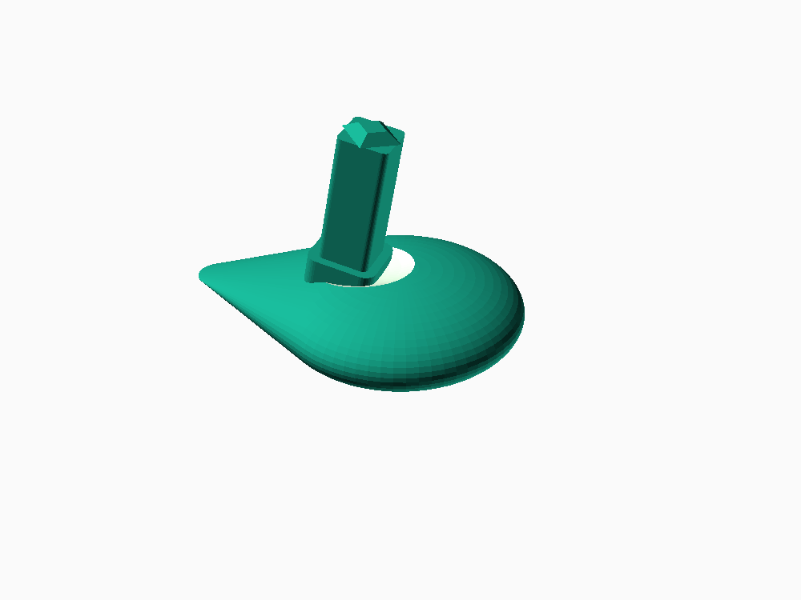

# Hobby Dreholive für Kleiderschrank (silber, 2009–2025) – 3D-Druckdatei

Nachbau der Dreholive aus den eBay-Fotos (Anbieter campingplus.de,
Art.-Nr. Ho4180270009) als druckfertige STL-Datei.

## Dateien

| Datei | Vierkant-Maß des Dorns | Wann verwenden |
|---|---|---|
| `dreholive_7mm-vierkant.stl` | 7 mm | **Standardgröße**, in der Möbelbeschlag-Branche der mit Abstand gebräuchlichste Wert für Dreholiven – zuerst probieren |
| `dreholive_6mm-vierkant.stl` | 6 mm | falls der Dorn spürbar zu dick ist / nicht in die Aufnahme passt |
| `dreholive_8mm-vierkant.stl` | 8 mm | falls der Dorn zu locker sitzt |
| `dreholive.scad` | – | Quelldatei (OpenSCAD), falls weitere Anpassungen nötig sind |

## Wichtiger Hinweis zur Genauigkeit

Es gab keine Konstruktionszeichnung, nur die zwei eBay-Fotos. Eines davon
zeigt eine vom Verkäufer eingezeichnete Bemaßung von **33 mm**. Dieser Wert
wurde 1:1 übernommen (Breite der Olive). Alle anderen Maße – Länge, Wölbung,
Länge des Dorns – sind aus den Bildproportionen abgeschätzt. Das **Vierkant-
Maß des Dorns (7 mm)** stammt nicht aus dem Foto (dort nicht messbar,
da verdeckt), sondern aus dem in der Branche üblichen Standardmaß für
Möbel-Dreholiven.

Das Ergebnis ist also ein **optisch sehr naher Nachbau, aber keine
1:1-Vermessung des Originalteils**. Für die Optik/Größe der Olive selbst
ist das unkritisch. Kritisch ist nur der Vierkant-Dorn, da er exakt in die
vorhandene Mechanik im Schrank passen muss – deshalb liegen hier drei
Varianten bei. Falls keine passt: den alten (abgebrochenen) Dorn-Rest oder
die viereckige Aufnahme in der Mechanik mit einer Schieblehre nachmessen
und in `dreholive.scad` die Variable `shaft_square` entsprechend anpassen
(Zeile am Dateianfang), dann neu exportieren.

## Drucken

- **Material:** PLA reicht für die Optik; PETG oder ABS sind stabiler und
  hitzebeständiger (Schrank in der Sonne/im Wohnwagen kann heiß werden).
- **Orientierung:** flach mit der gewölbten Olive auf dem Druckbett liegend
  drucken, Dorn zeigt nach oben – dann sind kaum bis keine Stützstrukturen
  nötig.
- **Fülldichte:** 25–40 % genügt, der Dorn ist die einzige mechanisch
  belastete Stelle (dort wird beim Drehen Kraft übertragen).
- **Wandstärke/Perimeter:** mindestens 3 Umfahrungen, damit der Dorn nicht
  gleich wieder abbricht (laut Kundenbewertungen ein bekannter Schwachpunkt
  des Originalteils).

## Anpassen

Alle Maße stehen als benannte Variablen am Anfang von `dreholive.scad`
(Länge, Breite, Wölbungshöhe, Dornlänge, Neigung usw.). Datei in OpenSCAD
(kostenlos, openscad.org) öffnen, Werte ändern, mit F6 rendern und über
„Export as STL" neu exportieren.
